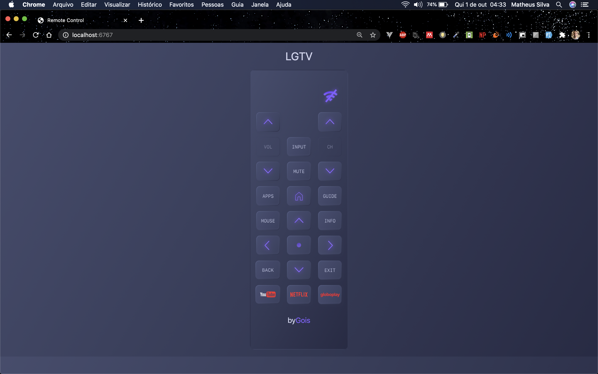

<h1 align="center">Welcome to server 👋</h1>
<p>
  <a href="https://www.npmjs.com/package/server" target="_blank">
    
  </a>
  <a href="https://github.com/MaatheusGois/LGTV-Controller#readme" target="_blank">
    
  </a>
  <a href="https://github.com/MaatheusGois/LGTV-Controller/graphs/commit-activity" target="_blank">
    
  </a>
  <a href="https://github.com/MaatheusGois/LGTV-Controller/blob/master/LICENSE" target="_blank">
    
  </a>
</p>

<p>
  
</p>
### 🏠 [Homepage](https://github.com/MaatheusGois/LGTV-Controller#readme)

## Install

```sh
npm install
```

## Usage

```sh
npm run start
```

## Author

👤 **Matheus Gois <matheusgoislimasilva@gmail.com>**

- Website: www.linkedin.com/in/maatheusgois/

- Twitter: [@maatheusgois](https://twitter.com/maatheusgois)

- GitHub: [@maatheusgois](https://github.com/maatheusgois)

- LinkedIn: [@maatheusgois](https://linkedin.com/in/maatheusgois)

- Dribbble: [@maatheusgois](https://dribbble.com/maatheusgois)

## 🤝 Contributing

Contributions, issues and feature requests are welcome!<br />Feel free to check [issues page](https://github.com/MaatheusGois/LGTV-Controller/issues). You can also take a look at the [contributing guide](https://github.com/MaatheusGois/LGTV-Controller/blob/master/CONTRIBUTING.md).

## Show your support

Give a ⭐️ if this project helped you!

## 📝 License

Copyright © 2020 [Matheus Gois <matheusgoislimasilva@gmail.com>](https://github.com/MaatheusGois).<br />
This project is [ISC](https://github.com/MaatheusGois/LGTV-Controller/blob/master/LICENSE) licensed.

---

_For God so loved the world that he gave his one and only Son, that whoever believes in him shall not perish but have eternal life. 🙌🏻 John 3:16 [read-the-bible](https://biblia.com/bible/esv/john/3/16)_

_This README was generated with ❤️ by [readme-md-generator](https://github.com/kefranabg/readme-md-generator)_
